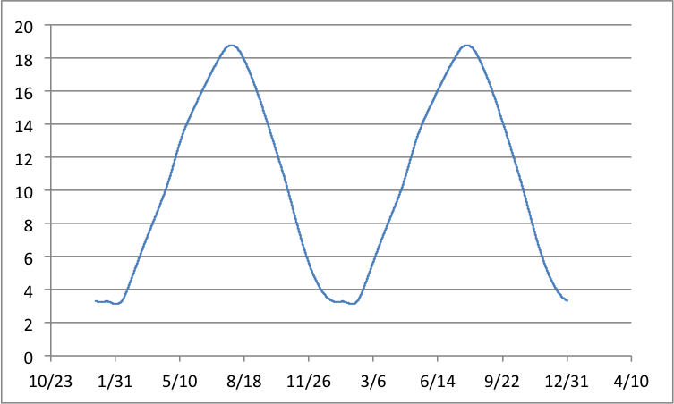
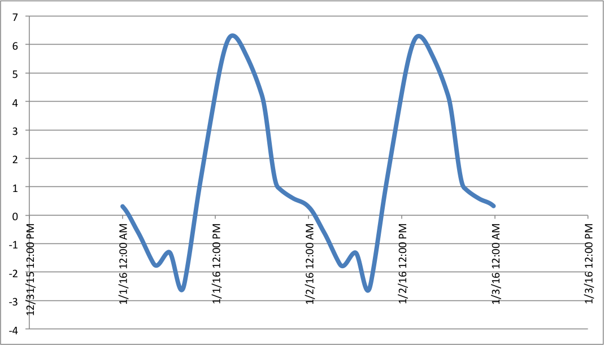
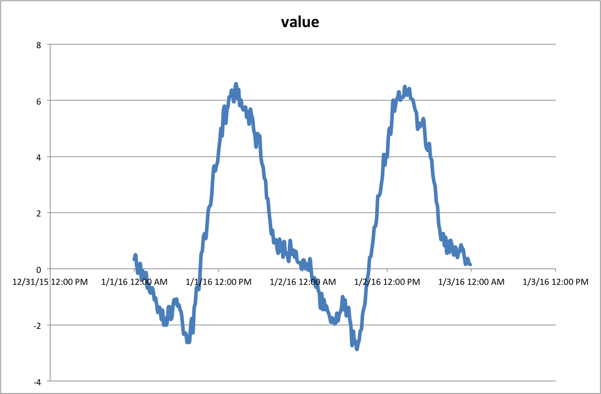

.. highlight:: none

.. _get_started:

Getting Started
***************

A First Generation
==================

The simpliest way to test the RTS-Gen project is to download the `last release of a runnable Jar file <https://github.com/cetic/rts-gen-cli/releases>`_ that contains an application based on the RTS-Gen library.
You will also need `a Java Virtual Machine <https://java.com>`_ installed on your environment.

For your first time series generation, we will specify a generator that propose a basic external temperature simulator for Uccle, Belgium.
According to the `Royal Meteorology Institute of Belgium <http://www.meteo.be/meteo/view/fr/360955-Normales+mensuelles.html>`_, the mean temperatures are as follows:

.. list-table::
    :header-rows: 1

    * - Month
      - Temperature
    * - January
      - 3.3
    * - February
      - 3.7
    * - March
      - 6.8
    * - April
      - 9.8
    * - May
      - 13.6
    * - June
      - 16.2
    * - July
      - 18.4
    * - Augustus
      - 18.0
    * - September
      - 14.9
    * - October
      - 11.1
    * - November
      - 6.8
    * - December
      - 3.9

So, we create a generator that describes the evolution of the temperator month per month::

    {
       "generators":[
       {
          "name": "monthly-basis",
          "type": "monthly",
          "points": {"january": 3.3, "february": 3.7, "march": 6.8, "april": 9.8, "may": 13.6, "june": 16.2,
                     "july": 18.4, "august": 18, "september": 14.9, "october": 11.1, "november": 6.8, "december": 3.9}
       }],
       "exported":[
          {"name": "temperature", "generator": "monthly-basis", "frequency": 3600000}
       ],
       "from": "2016-01-01 00:00:00.000",
       "to": "2017-12-31 23:59:59.999"
    }

(`Download this configuration <https://raw.githubusercontent.com/cetic/rts-gen/master/examples/get_started_1.json>`_)

The name and the attributes of each objects in this JSON document are described further in the rest of this documentation. At the moment,
we will only focus on the created configuration and the resulting values.

Save the configuration on a text file next to the downloaded application and run the application with the freshly created file as well as the limits of the
time period of interest:

.. parsed-literal::

    java -jar rst-gen-cli get_started_1.json

After a few seconds, you obtain a sequence of lines, each of them being a value entry made of a date, a series name, and a value separated by semicolons.
In this demonstration, the series name is always "temperature". If you plot the series values with your favourite tool, you should obtain something like the following plot:

Towards a more Realistic Model
==============================

So it works! The temperature continuously varies, and for the middle of each month it complies with the values specified in the configuration.
But you may be frustated by the regularity of the obtained values: they increase or decrease monotoneously from a month to the next one, which is not a
very realistic behaviour. Actually, for consecutive days, temperatures are globally higher during the day, and lower during the night.

We therefore create a new generator that expresses the variation of the temperature over the hours of a calendar day:

.. list-table::
    :header-rows: 1

    * - Hour
      - Relative Temperature
    * - 00:00
      - -3.0
    * - 02:00
      - -3.9
    * - 04:00
      - -5.0
    * - 06:00
      - -4.6
    * - 08:00
      - -5.7
    * - 10:00
      - -2.2
    * - 12:00
      - +1.0
    * - 14:00
      - +3.0
    * - 16:00
      - +2.3
    * - 18:00
      - +0.9
    * - 20:00
      - -2.3
    * - 22:00
      - -2.7

::

   {
      "generators": [
          {
             "name": "monthly-basis",
             "type": "monthly",
             "points": {
                "january": 3.3,
                "february": 3.7,
                "march": 6.8,
                "april": 9.8,
                "may": 13.6,
                "june": 16.2,
                "july": 18.4,
                "august": 18,
                "september": 14.9,
                "october": 11.1,
                "november": 6.8,
                "december": 3.9
             }
          },
          {
             "name": "daily-variation",
             "type": "daily",
             "points": {
                "00:00:00.000": -3,
                "02:00:00.000": -3.9,
                "04:00:00.000": -5,
                "06:00:00.000": -4.6,
                "08:00:00.000": -5.7,
                "10:00:00.000": -2.2,
                "12:00:00.000": 1,
                "14:00:00.000": 3,
                "16:00:00.000": 2.3,
                "18:00:00.000": 0.9,
                "20:00:00.000": -2.3,
                "22:00:00.000": -2.7
             }
          },
          {
             "name": "result",
             "type": "aggregate",
             "aggregator": "sum",
             "generators": [
                "monthly-basis",
                "daily-variation"
             ]
          }
       ],
       "exported": [
          {
             "name": "temperator",
             "generator": "result",
             "frequency": 600000
          }
       ],
       "from": "2016-01-01 00:00:00.000",
       "to": "2017-12-31 23:59:59.999"
    }

(`Download this configuration <https://raw.githubusercontent.com/cetic/rts-gen/master/examples/get_started_2.json>`_)

Please note that the values of this second generator are relative to an arbitrary "neutral" value.
Plotting these values is therefore not relevant. However, we sum the monthly temperatures with the daily ones in order
to obtain a more complex behaviour, and the more realistic resulting time series can be displayed:

In this image, only values from the first and the second of January 2016 are displayed. A daily basis pattern is easily observable,
while values are quite similar (although slightly different) from day to day.

However, a new further examination of the generated values reveals that the temperature variation remains unsatisfactory:
during a calendar day, the temperatures varies unrealistically, and two identical days in different years (for instance, 2016-02-03 and 2017-02-03)
have the same sequence of values. In the real life, the temperature slightly changes over time due to complex modifications of the atmospheric conditions.

In order to simulate these small changes, we introduce a generator that describe a noisy time series, and we sum it with the previously
defined generators.

::

   {
      "generators": [
         {
            "name": "monthly-basis",
            "type": "monthly",
            "points": {
               "january": 3.3,
               "february": 3.7,
               "march": 6.8,
               "april": 9.8,
               "may": 13.6,
               "june": 16.2,
               "july": 18.4,
               "august": 18,
               "september": 14.9,
               "october": 11.1,
               "november": 6.8,
               "december": 3.9
            }
         },
         {
            "name": "daily-variation",
            "type": "daily",
            "points": {
               "00:00:00.000": -3,
               "02:00:00.000": -3.9,
               "04:00:00.000": -5,
               "06:00:00.000": -4.6,
               "08:00:00.000": -5.7,
               "10:00:00.000": -2.2,
               "12:00:00.000": 1,
               "14:00:00.000": 3,
               "16:00:00.000": 2.3,
               "18:00:00.000": 0.9,
               "20:00:00.000": -2.3,
               "22:00:00.000": -2.7
            }
         },
         {
            "name": "noise",
            "type": "arma",
            "model": {
               "std": 0.2,
               "c": 0,
               "seed": 1234
            },
            "timestep": 300000
         },
         {
            "name": "result",
            "type": "aggregate",
            "aggregator": "sum",
            "generators": [
               "monthly-basis",
               "daily-variation",
               "noise"
            ]
         }
      ],
      "exported": [
         {
            "name": "temperator",
            "generator": "result",
            "frequency": 600000
         }
      ],
      "from": "2016-01-01 00:00:00.000",
      "to": "2017-12-31 23:59:59.999"
   }

(`Download this configuration <https://raw.githubusercontent.com/cetic/rts-gen/master/examples/get_started_3.json>`_)

The final result is now realistic enough for a basic simulation of the temperature over time.
When observing the plot of its values, clear and realistic patterns emerge, while a realistic noise is also clearly present.

Not satisfied by the realism of the generated values? Don't hesitate to modify the parameters of the generators described in the
configuration file or to try other :ref:`generators`.